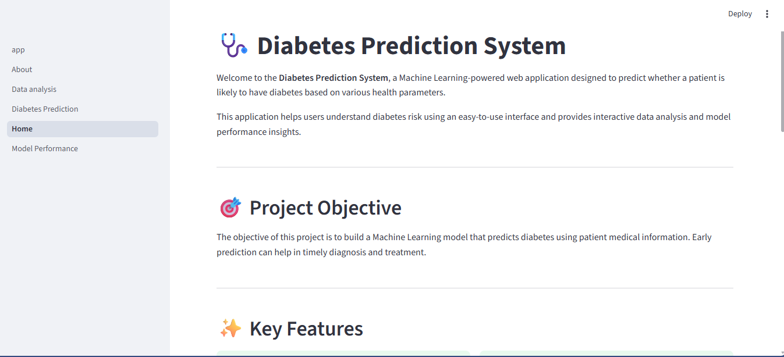
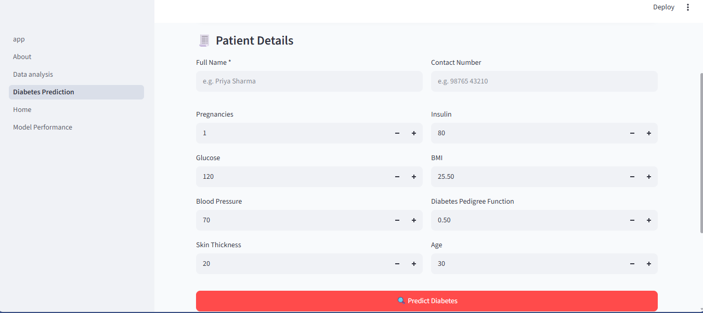
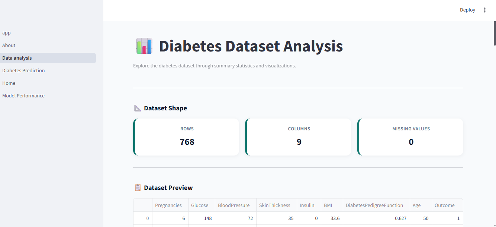
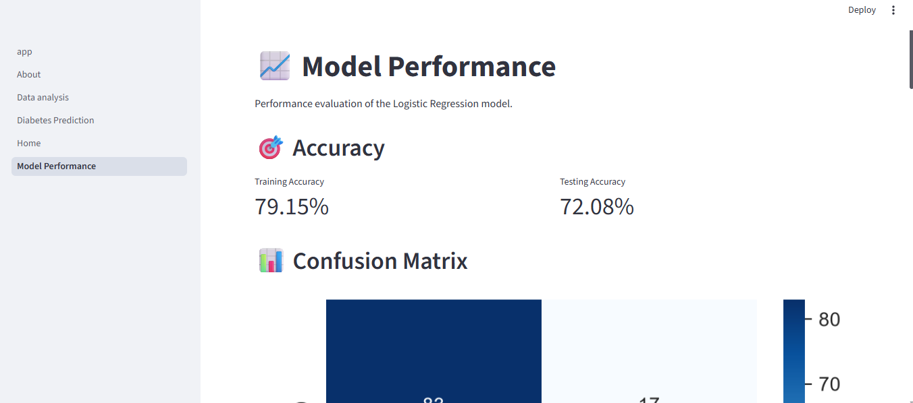
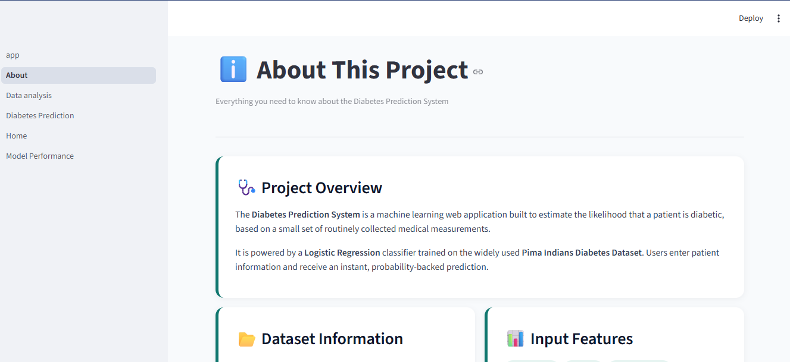

# 🩺 Diabetes Prediction System

> **A Machine Learning-powered web application that predicts the likelihood of diabetes using patient health parameters.** Built with **Python**, **Streamlit**, **Scikit-learn**, and **SQLite**, this application offers an interactive interface for prediction, data visualization, and model performance evaluation.

---

## 🌟 Project Highlights

- 🧠 Machine Learning-based Diabetes Prediction
- 📊 Interactive Data Analysis Dashboard
- 📈 Model Performance Evaluation
- 💾 Patient Record Management using SQLite
- 🎨 Clean & User-Friendly Streamlit Interface
- ⚡ Fast and Responsive Web Application

---

## 📌 Problem Statement

Diabetes is one of the most common chronic diseases worldwide. Early prediction can help healthcare professionals and individuals take preventive measures before serious complications occur.

This project leverages Machine Learning to estimate diabetes risk based on patient medical information, providing quick and reliable predictions through an intuitive web interface.

---

## ✨ Features

- 🔹 Predict diabetes risk using patient medical data
- 🔹 Interactive Streamlit-based user interface
- 🔹 Data Analysis & Visualization
- 🔹 Model Performance Dashboard
- 🔹 SQLite Database for Patient Records
- 🔹 Easy-to-use and responsive design

---

## 🛠️ Tech Stack

| Category | Technologies |
|----------|--------------|
| Programming | Python |
| Web Framework | Streamlit |
| Machine Learning | Scikit-learn |
| Data Processing | Pandas, NumPy |
| Visualization | Matplotlib, Seaborn, Plotly |
| Database | SQLite |
| Model Storage | Joblib |

---

## 🧠 Machine Learning Model

| Item | Details |
|------|---------|
| Algorithm | Logistic Regression |
| Problem Type | Binary Classification |
| Dataset | Pima Indians Diabetes Dataset |
| Target Variable | Outcome |

---

## 📊 Input Features

The prediction model uses the following medical attributes:

- Pregnancies
- Glucose
- Blood Pressure
- Skin Thickness
- Insulin
- BMI
- Diabetes Pedigree Function
- Age

---

## 📂 Project Structure

```text
Diabetes-Prediction-System/
│
├── assets/
├── images/
├── Pages/
├── screenshots/
├── app.py
├── train_model.py
├── db_utils.py
├── diabetes.csv
├── model.pkl
├── scaler.pkl
├── requirements.txt
├── README.md
└── .gitignore
```

---

## 🚀 Installation

### Clone the repository

```bash
git clone https://github.com/diyamohan78/Diabetes-Prediction-System.git
```

### Install dependencies

```bash
pip install -r requirements.txt
```

### Run the application

```bash
streamlit run app.py
```

---

## 📸 Project Screenshots

### 🏠 Home Page



### 🩺 Diabetes Prediction



### 📊 Data Analysis



### 📈 Model Performance



### ℹ️ About Page



---

## 🎯 Future Enhancements

- 🤖 Compare multiple Machine Learning models
- ☁️ Deploy on Streamlit Community Cloud
- 🔐 User Authentication
- 📄 Download Prediction Reports (PDF/CSV)
- 📊 Explainable AI (SHAP/LIME)
- 🌐 Cloud Database Integration

---

## 👩‍💻 Author

**Diya Mohan**

🎓 Aspiring Data Analyst & Data Scientist

📧 **Open to internships and entry-level opportunities in Data Analytics and Data Science.**

---

## ⭐ Support

If you found this project helpful, consider **starring ⭐ the repository** and sharing your feedback.
